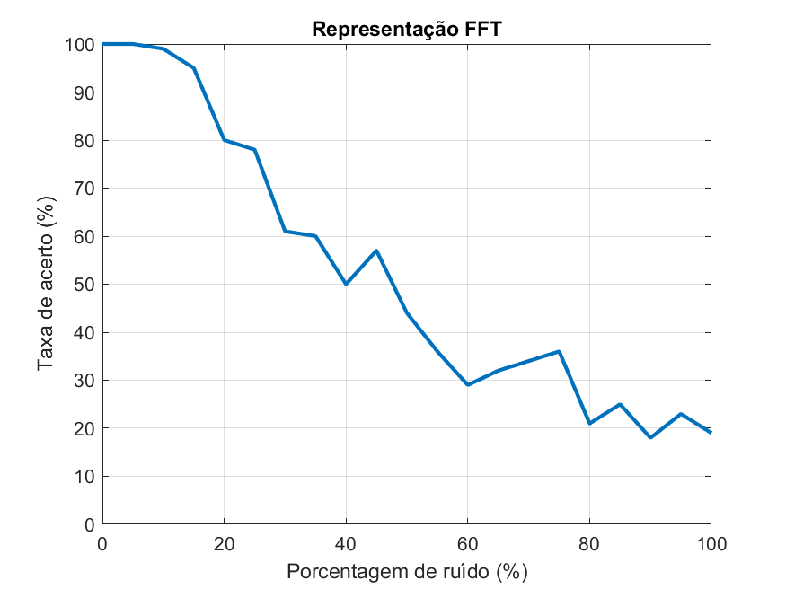
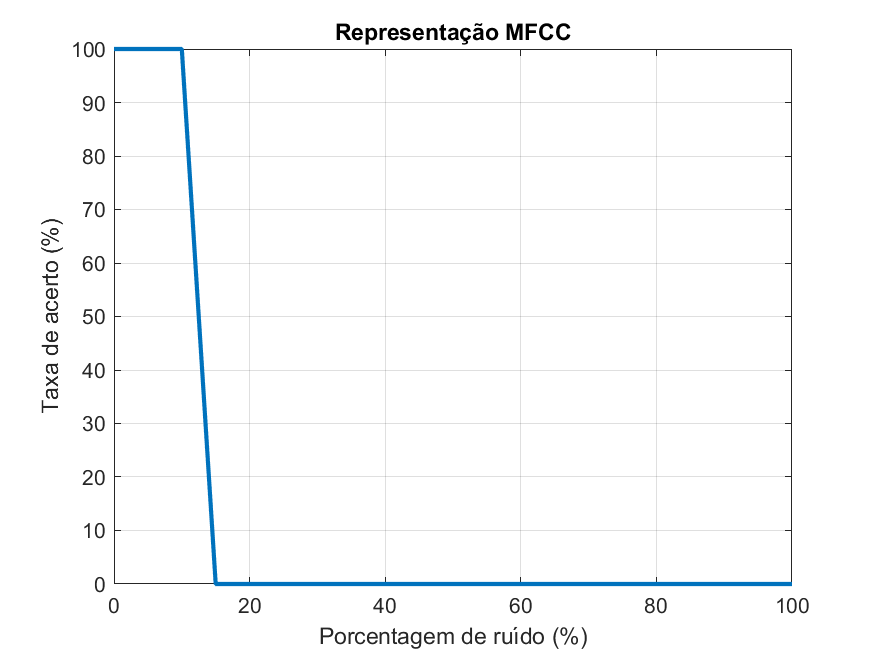
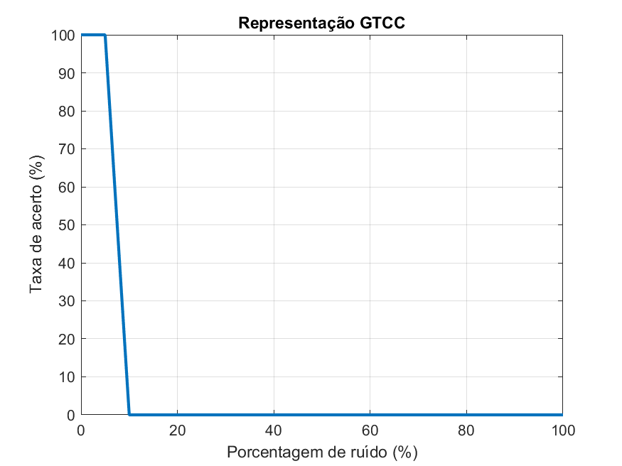
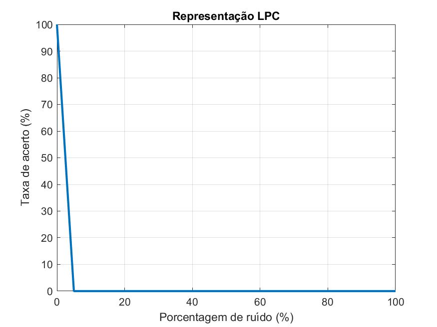

# Teste 1
Montamos uma base de teste contendo 30 arquivos de áudio.
Cada arquivo de áudio é passado inteiramente por uma transformação (FFT, STFT, GTCC, MFCC e LPC) usando os seguintes parâmetros:
- FFT:
    - 1024 pontos
- STFT:
    - Overlap de 50%
    - Janela de Hanning de 1024 pontos
- GTCC:
    - parâmetros padrões
- MFCC:
    - parâmetros padrões
- LPC:
    - 1024 pontos

Escolheu-se um arquivo tido como instância de inferência, que foi infectado por AWGN com SNR ajustada em função da porcentagem do RMS do sinal de áudio (entre 0% e 100%)

Calculou-se o erro quadrático acumulado entre a instância de inferência e a base de dados em 100 experimentos independentes (Monte-Carlo) por valor de SNR. Anotou-se a taxa de acerto para cada um desses valores.

Resultados observados:
FFT (10000 experimentos):

STFT (10000 experimentos):

MFCC (10000 experimentos):

GTCC (10000 experimentos):

LPC (10000 experimentos):

Conclusões:
1.	FFT apresentou um resultado bem robusto ao ruído
2.	STFT deve ter algum erro, pois sempre acertou em 100% dos experimentos independentemente da SNR. Isso tem que ser avaliado. O teste foi estendido para que o sinal fosse 100 vezes mais fraco do que o ruído. Houve taxa de acerto acima de 0 para valores de intensidade de de ruído de cerca de 3000%. Tem algo errado aqui. Decidimos por estudar mais o método e descartá-lo temporariamente.
3.	MFCC, LPC, GTCC são extremamente sensíveis ao ruído.
4.	Por causa dos itens 2 e 3, talvez o critério de desempenho, que é utilizar um processo de máxima-verossimilhança, tenha que ser mudado.
